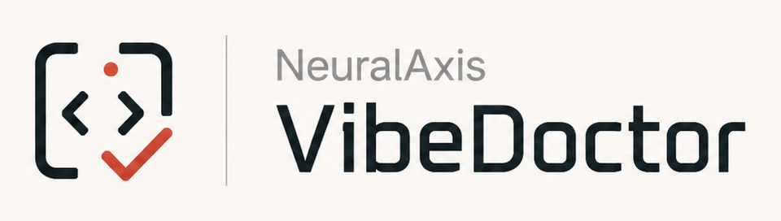

# VibeDoctor

<p align="center">
  
</p>

**A local health check for code you did not write line by line.**

VibeDoctor scans JavaScript, TypeScript, Python, and mixed repositories for code-health, security, privacy, testing, and maintainability problems. It combines repository-local scanner output into one ranked report, one normalized finding format, and a fix-next plan that humans and coding agents can use without interpreting a wall of unrelated logs.

```bash
npx @neuralaxis/vibedoctor scan --changed
```

VibeDoctor runs locally by default. Missing or failed scanners are reported as incomplete evidence, never silently counted as a clean result.

The public product site lives in [`website/`](website/README.md) and deploys from GitHub Pages.

## Start here

Choose the shortest path for what you are doing:

| Goal | Command |
| --- | --- |
| Check files changed in Git | `npx @neuralaxis/vibedoctor scan --changed` |
| Run a fast repository check | `npx @neuralaxis/vibedoctor scan --quick` |
| Run the most complete check | `npx @neuralaxis/vibedoctor scan --full` |
| Prepare local scanner tools | `npx @neuralaxis/vibedoctor setup` |
| Get a repair plan for an AI agent | `npx @neuralaxis/vibedoctor agent-plan --format markdown` |
| Check India DPDP technical readiness | `npx @neuralaxis/vibedoctor dpdp scan --full` |

For a new repository, initialize the config and review the scanner setup plan:

```bash
npx @neuralaxis/vibedoctor init
npx @neuralaxis/vibedoctor setup
npx @neuralaxis/vibedoctor setup --apply
npx @neuralaxis/vibedoctor scan --quick
```

`setup --apply` installs supported recommended tools, so review the plan before applying it. To use the shorter `vibedoctor` command everywhere:

```bash
npm install -g @neuralaxis/vibedoctor
```

## What you get

Every scan reports both repository health and scan completeness. It highlights blockers, the next fixes, privacy findings, skipped or failed tools, and exact recovery commands.

Default artifacts are written under `.vibedoctor/`:

```text
.vibedoctor/
├── report.json       # automation and agents
├── report.html       # human review
└── agent-plan.md     # ordered repair work
```

Use the terminal report for quick triage, HTML for review, JSON for automation, and `agent-plan.md` for a coding agent.

## What VibeDoctor checks

- Type and lint failures from TypeScript, Pyright, Ruff, Biome, and similar local tools.
- Secrets, vulnerable dependencies, and insecure patterns from Gitleaks, OSV-Scanner, Semgrep, and project-native scanners when available.
- Dead or unused code from Knip, Vulture, deptry, and VibeDoctor's dead-chain detector.
- AI and legacy leftovers such as stale TODOs, commented-out code, fallback flags, and half-removed features.
- Refactor-readiness hotspots, duplication, complexity, tests, and coverage signals.
- Regulated identifiers, personal-data fields, sensitive attributes, and risky combinations through deterministic privacy checks and optional Presidio support.

VibeDoctor detects the repository shape and discovers applicable local tools. A missing optional tool is marked `SKIPPED`; a failed or timed-out required tool can make the result `PARTIAL` or `INVALID`.

## Know exactly what ran

Every scan prints a coverage table with one row per tool, so "installed" is never confused with "completed":

```
TOOL COVERAGE
TOOL      STATE           FINDINGS   TIME   DETAIL
biome     completed       200 of 223 1.8s   Ran at node_modules/.bin/biome.cmd.
semgrep   timed out       0          300.0s Exceeded its 300s budget and was stopped, so this check did not run.
pyright   not applicable  0                 Nothing in this repository matches what pyright analyses.
vulture   not installed   0                 vulture was not found on the scanner's PATH.

TO RESTORE COVERAGE
- semgrep: Raise runtime.tool_timeouts.semgrep, or run `vibedoctor scan --changed` for a diff-scoped run.
```

Each row separates the facts that used to be collapsed into "skipped":

- **applicable** — is there anything here for this tool to analyse?
- **installed** — did the executable resolve, and at which path?
- **executed** — did it start, and did it finish inside its time budget?
- **findings shown of reported** — a tool that ran but had output filtered shows `200 of 223`, so a short list is never mistaken for a clean one.

States are `completed`, `partial`, `timed out`, `failed`, `not installed`, `runtime mismatch`, `deferred`, `disabled`, `not applicable`, and `not selected`. Only the first is treated as full coverage; deliberate exclusions do not count against you, and everything else is disclosed with a reason and a remediation.

`vibedoctor setup --apply` verifies each tool by running it the way the scanner will, reports the resolved path and version, and **fails if a tool cannot be verified** — even when the install command itself succeeded. Tools that install but cannot run under the current runtime are reported as a runtime mismatch, with the option to defer them deliberately via `runtime.deferred_tools`.

## Keeping the report readable

Scanners are tuned for recall, so raw output buries the findings that matter. VibeDoctor applies uniform relevance controls and always discloses what they withheld:

- **Ranking** puts new findings and findings in changed files first, so pre-existing debt does not hide a regression you just introduced.
- **Per-tool caps** keep an exhaustive detector from dominating the report. What falls outside the cap is reported as a count with the setting to raise.
- **Confidence floors** apply per tool.
- **File roles** — tests, fixtures, generated, and vendored code are recognised, and findings there are downgraded rather than presented like production defects.
- **Contextual validation** re-checks findings that claim to have found a credential. A match on an identifier like `format_key` is downgraded and marked as a likely false positive, with the reason given; a genuine high-entropy token keeps full severity.
- **Evidence grades** — every finding records whether it was `verified` from code, `observed` at a location, inferred as a `heuristic`, or `unproven`, so a naming guess never reads like a traced code path.

```
REPORT FILTERING
Relevance: showing 54 of 124 findings.
- vulture: showing 50 of 120 — withheld 70 beyond the 50-finding cap.
To see withheld findings:
- Raise relevance.per_tool.vulture.max_findings in vibedoctor.yml.
```

## Acknowledging findings you have already decided about

`.vibedoctor/suppressions.yml` records findings that are known and accepted. Unlike the baseline, which only answers "was this here before?", an acknowledgement carries a reason and an expiry:

```yaml
version: 1
suppressions:
  - id: fixture-credentials
    reason: Synthetic credentials in test fixtures, never used against real systems.
    classification: fixture      # false_positive | accepted_risk | deferred | fixture
    owner: platform-team
    expires: 2026-12-31
    match:
      tools: [gitleaks]
      paths: ["fixtures/**"]
```

A reason is required, and a rule with no match criteria is rejected rather than silencing the report. When an acknowledgement lapses, its findings come back marked `resurfaced` instead of staying hidden. Acknowledgements apply to every finding, including DPDP ones.

## Understand the result before fixing code

| Status | Meaning | What to do |
| --- | --- | --- |
| `COMPLETE` | All required checks completed. | Work through the ranked findings. |
| `PARTIAL` | Some checks were skipped, failed, or timed out. | Follow `recoveryActions`; do not rely on the score alone. |
| `INVALID` | There is not enough trustworthy evidence for an authoritative result. | Recover the required scanners and scan again before editing. |

CLI exit codes let people, agents, and CI distinguish health failures from missing evidence:

| Code | Meaning |
| --- | --- |
| `0` | The scan completed and configured gates passed. |
| `1` | One or more configured health gates failed. |
| `2` | Required checks were incomplete. |

Skipped scanners are never treated as clean results. Privacy findings affect the privacy category score by default, but do not lower the overall score or fail CI unless you opt into privacy gates.

If a scanner times out or fails, run the recovery command shown in the report. For example:

```bash
vibedoctor tool retry semgrep --timeout 600
```

## A fast, safe repair loop

```bash
# 1. Establish the current state
vibedoctor scan --changed --report json

# 2. Generate ordered work
vibedoctor agent-plan --format markdown

# 3. Optionally apply supported safe tool fixes
vibedoctor fix --safe

# 4. Review every change, then verify
vibedoctor verify
```

Use `vibedoctor explain <finding-id>` when a finding needs more context. Always review generated changes before committing them.

For an inherited repository, baseline existing debt and fail only on new findings:

```bash
vibedoctor baseline create
```

```yaml
baseline:
  fail_only_on_new_issues: true
```

## Using VibeDoctor with AI agents

The quickest one-off handoff is `.vibedoctor/agent-plan.md`. An agent should follow this protocol:

1. Run the appropriate scan.
2. Read `completeness.status`, `toolStatuses`, `skippedTools`, and `recoveryActions` in `.vibedoctor/report.json`.
3. Recover required scanners before treating findings or scores as authoritative.
4. Fix only the ranked, in-scope findings and preserve unrelated user changes.
5. Run `vibedoctor verify` after edits.
6. Report remaining findings and any incomplete evidence; never claim success from a `PARTIAL` or `INVALID` scan.

For repeated agent use, install repository-scoped instructions, skills, policy, and supported editor wiring:

```bash
vibedoctor agent init --targets all
vibedoctor agent doctor --targets all
```

This can generate `AGENTS.md`, `.agents/skills/`, target-specific skills for Claude and GitHub, Cursor rules and MCP config, and `.vibedoctor/agent-policy.yml`.

To create installable Codex and Claude plugin bundles under `plugins/vibedoctor/`:

```bash
vibedoctor agent plugin --targets all --force
```

### MCP server

Start the MCP server over standard input/output:

```bash
vibedoctor mcp
```

It exposes structured operations for changed and full scans, report retrieval, finding explanations, safe fixes, repair plans, verification, privacy review, and DPDP technical readiness. Generated agent configs include MCP wiring where the target supports it.

## Privacy Review

Privacy Review is deterministic-first and advisory by default. Evidence stored in reports is masked or classified instead of preserving raw PII.

```bash
vibedoctor scan --category privacy --report json
vibedoctor privacy-review --refresh --format markdown
```

The second command writes a structured review artifact to `.vibedoctor/privacy-review.json`. Optional AI adjudication runs only when explicitly enabled and the configured API-key environment variables are present.

To make high-confidence privacy findings blocking, opt in:

```yaml
checks:
  privacy:
    fail_on_regulated_identifiers: true
    fail_on_sensitive_attributes: true
```

## DPDP technical readiness

VibeDoctor includes an engineering-focused module for India's Digital Personal Data Protection framework. It maps apparent personal-data processing, evaluates visible technical controls, identifies deterministic technical risks, and creates a human-review queue.

It provides **technical readiness evidence, not legal compliance or certification**. Static analysis cannot establish legal applicability, production behavior, contractual adequacy, notice quality, or organisational policy implementation.

```bash
vibedoctor dpdp init
vibedoctor dpdp scan --full
```

Common commands:

| Goal | Command |
| --- | --- |
| Scaffold optional context and evidence | `vibedoctor dpdp init` |
| Full technical-readiness scan | `vibedoctor dpdp scan --full` |
| Collect evidence from changed files | `vibedoctor dpdp scan --changed` |
| Print the personal-data map | `vibedoctor dpdp map` |
| Print questions requiring human review | `vibedoctor dpdp review-queue` |
| Render a report | `vibedoctor dpdp report --json`, `--html`, or `--markdown` |
| Generate an agent handoff | `vibedoctor dpdp handoff` |
| Verify after changes | `vibedoctor dpdp verify` |
| Explain a control or finding | `vibedoctor dpdp explain <id>` |

Artifacts are stored in `.vibedoctor/dpdp/`:

```text
data-map.json
control-matrix.json
evidence-ledger.json
review-queue.md
agent-handoff.md
readiness-report.json
readiness-report.md
readiness-report.html
```

Controls distinguish repeatable `DETERMINISTIC` checks, uncertain `TECHNICAL_SIGNAL`s, human-supplied `DECLARED_EVIDENCE`, and `HUMAN_REVIEW`. Absence of evidence is never marked `VERIFIED`, and skipped optional scanners are never passes.

`dpdp scan` always refreshes the artifacts. `map`, `report`, `review-queue`, `handoff`, and `explain` reuse cached artifacts unless passed `--refresh`; `verify` always performs a live changed-scope scan. If Git has no changed-file delta, changed-scope collection falls back to the full repository and records a capability warning.

Presidio and Semgrep evidence collection are on by default and can be independently disabled under `checks.dpdp`. Normal scans also include DPDP privacy findings when `checks.dpdp.enabled` is true.

## Configuration

`vibedoctor init` writes `vibedoctor.yml`. Editing is optional. The most useful settings are:

```yaml
score:
  minimum: 80

baseline:
  fail_only_on_new_issues: true

runtime:
  default_timeout_seconds: 120
  tool_timeouts:
    biome: 180
    semgrep: 300
  required_tools:
    - biome
    - semgrep
  fail_on_incomplete_scan: true
  on_timeout: scoped_retry     # scoped_retry | skip | fail
  total_budget_seconds: 0      # 0 means no wall-clock ceiling
  deferred_tools: []           # deliberately not run; reported as deferred

relevance:
  min_confidence: low
  max_findings_per_tool: 200
  synthetic_file_policy: downgrade   # keep | downgrade | drop
  validate_secrets: true
  per_tool:
    vulture:
      min_confidence: medium
      max_findings: 50

suppressions:
  enabled: true
  file: .vibedoctor/suppressions.yml

paths:
  include:
    - src/**
  exclude:
    - dist/**
    - coverage/**
```

- `score.minimum` sets the passing health score.
- `baseline.fail_only_on_new_issues` limits gates to debt introduced after the baseline.
- `runtime.required_tools` defines which scanners must complete.
- `runtime.tool_timeouts` sets scanner-specific deadlines.
- `runtime.on_timeout: scoped_retry` reruns a tool that runs out of time over changed files only, and reports the partial coverage instead of losing the check.
- `runtime.deferred_tools` marks tools you have deliberately chosen not to run, so the report says "deferred" rather than implying they passed.
- `relevance.*` controls how much of what the tools report reaches the report. Nothing is dropped silently.
- `suppressions.*` points at the acknowledgements file described above.
- `checks.*` enables categories and their gates.
- `checks.privacy.*` controls privacy detection, masking, optional AI review, and blocking behavior.
- `checks.dpdp.*` controls technical-readiness evidence, organisation context, optional scanners, and deterministic gates.
- `paths.include` and `paths.exclude` scope the scan.

Human-review-only DPDP items do not fail CI. Configure `checks.dpdp.fail_on_severity` or `checks.dpdp.fail_on_violated_controls` when deterministic DPDP findings should block a build.

## Command reference

| Goal | Command |
| --- | --- |
| Initialize configuration | `vibedoctor init` |
| Plan or apply scanner setup | `vibedoctor setup` / `vibedoctor setup --apply` |
| Quick, changed, or full scan | `vibedoctor scan --quick` / `--changed` / `--full` |
| Scan selected categories | `vibedoctor scan --category dead_code,leftovers` |
| Render a fresh full report | `vibedoctor report --json`, `--html`, `--markdown`, `--sarif`, or `--agent` |
| Apply supported safe fixes | `vibedoctor fix --safe` |
| Verify changed files | `vibedoctor verify` |
| Create a baseline | `vibedoctor baseline create` |
| Explain a finding | `vibedoctor explain <finding-id>` |
| Retry a scanner | `vibedoctor tool retry <tool-id> [--timeout 600]` |
| Generate an agent plan | `vibedoctor agent-plan --format markdown` |
| Start MCP | `vibedoctor mcp` |

`scan --report` supports `terminal`, `json`, `html`, `agent`, and `agent-json`. The separate `report` command performs a fresh full scan and can also render Markdown or SARIF to standard output.

## Network and data behavior

Core scanning and report generation run locally and do not require a hosted VibeDoctor service. Setup commands may download tools, dependency scanners may query their own data sources, and optional AI integrations may contact the configured service. Review an integration before enabling it if source code or findings may leave the machine.

## Development

Requirements: Node.js 18 or newer and npm 10.x.

```bash
npm test
npm run typecheck
npm run build
npm pack --dry-run
```

Useful local commands:

```bash
npm run dev -- scan --quick
npm run dev -- agent init --targets all
npm run dev -- agent plugin --targets all --force
```

| Path | Purpose |
| --- | --- |
| `src/adapters` | Scanner adapters and parsers |
| `src/core` | Project detection, scan planning, scoring, baselines, and execution |
| `src/cli` | Command-line interface |
| `src/agentPack` | Agent instructions, skills, policies, and plugin generation |
| `src/dpdp` | DPDP evidence collection, controls, and reports |
| `src/mcp` | MCP server and tool definitions |
| `src/reporters` | Terminal, JSON, Markdown, HTML, SARIF, and agent reports |
| `fixtures` | Sample repositories used by tests |
| `tests` | Unit, integration, and snapshot tests |

## License

VibeDoctor is licensed under GPL-3.0-or-later.
